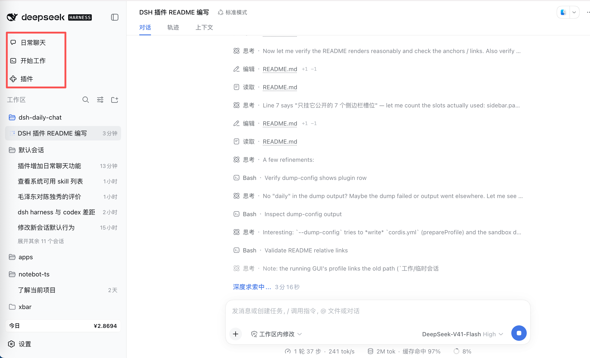

# dsh-daily-chat

> 给 DSH（DeepSeek Harness）的「新会话」加上第二重含义：**日常聊天** 与 **开始工作**。
>
> 日常模式跑一个只有对话能力的轻量 agent —— 有人格、能联网检索、能向你提问、能压缩上下文，但没有文件读写、没有 Shell、没有计划模式、没有子代理；工作模式完全沿用 DSH 原有行为，一行都不改。

一个纯客户端 DSH 插件：不 fork DSH 本体，只往它公开的 4 个槽位注册 7 条内容、外加一个服务补丁，DSH 升级后不会把插件带坏。

<div align="center">
  
  <br />
  <sub>侧边栏顶部多出「日常聊天」「开始工作」两行，原生「新会话」按钮被隐藏；日常模式下工作区区域会换成日常会话列表</sub>
</div>

## 📑 目录

- [它解决什么问题](#它解决什么问题)
- [两种模式](#两种模式)
- [安装](#安装)
- [使用](#使用)
- [工作原理](#工作原理)
- [配置项](#配置项)
- [目录结构](#目录结构)
- [开发](#开发)
- [已知限制](#已知限制)
- [卸载](#卸载)
- [License](#license)

## 它解决什么问题

DSH 原本只有一个「新会话」，而它一定是完整的编码 Agent：带着工作目录、bash、文件读写、计划模式、子代理。用它来问一句「今天天气怎么样」或者闲聊两句，代价是模型手里攥着一整套会往仓库里动手的工具，提示词里也全是工程上下文 —— 答话的语气和边界都被带偏。

这个插件把入口拆成两个，像 ChatGPT 把 chat 和 work 分开那样：

| | 日常 | 工作 |
|---|---|---|
| 你点的是 | 侧边栏「日常聊天」 | 侧边栏「开始工作」，或其它任何「新会话」入口 |
| 跑的是哪个 agent | `daily` 预设 | profile 默认预设（默认 `standard`） |
| 模型手里的工具 | 对话人格、网页检索/抓取、提问、上下文压缩 | 全部 |
| 侧边栏那一片 | 换成日常会话列表 | 原生工作区浏览器 |
| 会话落在哪 | 专属工作区（标题「日常聊天」） | 原有工作区 |
| 记忆 / 图片识别 / 模型路由 | 照常可用 | 照常可用 |

「日常」是一块真实的工作区而不是一个 UI 开关，所以日常对话是正常 Session：历史留得住，列表就是记账到该工作区的会话。

## 两种模式

| | 日常聊天 | 开始工作 |
|---|---|---|
| 侧边栏入口 | 「日常聊天」整行，`order: -20` | 「开始工作」整行，`order: -10` |
| 预设 | `daily` | profile 默认（本机为 `standard`） |
| 核心循环 | 用户消息 → 模型 → 工具调用（检索 / 提问）→ 回复 | 用户消息 → 模型 → 工具调用（读文件 / 改文件 / 跑命令 / 计划 / 子代理）→ 回复 |
| 会话列表 | 日常会话，按更新时间倒序，运行中带绿点 | 原生分组列表 |

两行都排在「插件」之上（该行 `order: 0`，槽位按 `priority`、`order` 升序排）。原生侧边栏的「新会话」按钮会被隐藏，由这两行取代；macOS 窗口控件等其它「新会话」入口仍然在，并按当前模式路由。

## 安装

### 0. 前置条件

- 一个可运行的 DSH web profile。本版本在 DSH `0.1.6-alpha.2`、macOS 上验证过；依赖的槽位契约是 `sidebar.panellist` / `sidebar.workspaces` / `shell.overlay` / `main`。
- 插件只贡献客户端（`dsh.client.platform: web`），没有构建步骤。

### 1. `daily` agent 预设：插件自己装

日常模式跑的 `daily` 预设随仓库发布在 [preset/daily/](./preset/daily)：[preset.yml](./preset/daily/preset.yml) 是选择器里的显示名与描述，[agent.cordis.yml](./preset/daily/agent.cordis.yml) 决定这个预设装哪些行（人格、网页工具、提问工具、压缩组）。

DSH 的用户预设根固定是 `<dshHome>/.agent-presets/<presetId>/`，而插件没有任何办法声明「我自带一个预设」，所以 **Host 半在加载时把包里这份复制到那里**，装完即用，不需要你手工操作。

规则是**装上、不覆盖**：

- 目标位置已经有 `agent.cordis.yml`（你已经有一份自己的 `daily`）→ 什么都不做，你的内容留着；
- 只有目录、没有组装文件（半成品或坏预设）→ 补齐；
- 想自定义 → 直接改 `<dshHome>/.agent-presets/daily/` 下的文件，或者先手工 `cp -R preset/daily ~/.dsh/.agent-presets/daily` 再改，插件都不会动它；
- 复制失败只打一条 warn，其它功能照常。

> 没有这个预设也能跑起来：插件选预设失败时只打一条 warn 并回退到 profile 默认预设，代价是日常会话又变回完整编码 Agent —— 日常模式就失去意义了。预设文件改动后，新会话即生效，不需要重启。

### 2. 把插件装进 profile

插件是 `private` 的本地包（包名 `@local/dsh-daily-chat`，不会发布到 npm），用链接方式装进某个 profile。

**方式 A：Web 侧边栏「插件」页** —— 安装组合包，填本仓库目录的绝对路径。管理器会读该目录的 `package.json`，确认它声明了 bundle patch，装好后默认启用。

**方式 B：命令行**

```bash
dsh plugin --profile web add link:/path/to/dsh-daily-chat
```

然后确认 profile manifest `~/.dsh/profiles/web/package.json` 的 `dsh.profile.bundles` 里包含了 `@local/dsh-daily-chat`，没有就手动加在列表末尾 —— bundles 是插件挂载顺序，放最后即可：

```json
"bundles": [
  "@deepseek-ai/dsh-base",
  "@deepseek-ai/dsh-web-app",
  "@local/dsh-daily-chat"
]
```

### 3. 生效

重启 `dsh web`，刷新页面。部署里启用了 HMR 的话配置改动会自己生效，否则运行中的组合会保留到重启。侧边栏面板列表顶部会多出「日常聊天」和「开始工作」两行（见[文首截图](./assets/sidebar-modes.png)），原生「新会话」按钮同时消失。

装好后开一个**新会话**验证：点「日常聊天」应该直接落在一个空白会话的输入框里，且该会话没有 bash / 文件类工具。

## 使用

- **点「日常聊天」** —— 解析（必要时创建）日常工作区 → 打开一个空白会话 → 把它的预设切成 `daily` → 把中间栏交还会话。中间只会闪一帧占位文字，不会停在中间页。
- **点「开始工作」** —— 记下工作模式，走 DSH 原生的 `startSession`。
- **模式会记住** —— 存在 localStorage 的 `dsh.daily-chat.mode`，读写失败时一律按 `work` 处理，不改变原有习惯。
- **日常列表** —— 日常模式下，侧边栏工作区区域被替换成日常会话列表：点一行打开该会话并确保仍处于日常模式；标题栏右侧的「＋ 日常聊天」等同于点「日常聊天」。
- **点击串台保护** —— 一次日常会话还没打开时又点了「开始工作」，以最后一次为准（内部用递增 ticket 作废过期的启动）。
- **失败会说话** —— 日常工作区准备不出来时会退回系统目录选择框让你手挑一个文件夹；仍然失败则在左下角弹一张提示卡，而不是静默什么都不发生。

## 工作原理

### Host 半 —— [index.js](./index.js)

做两件浏览器做不可靠的事：

1. **装 `daily` 预设。** 把包内 [preset/daily/](./preset/daily) 复制到 `<harness home>/.agent-presets/daily/`。DSH 的预设名单只合并「随 harness 发布的 + 部署配置的根 + 用户根」，插件无法声明自己带一个预设，所以只能落到用户根。已经存在就不动（你的改动优先），半成品则补齐。
2. **建并注册日常工作区。** 在 `<DSH_HOME>/daily-chat`（默认 `~/.dsh/daily-chat`）建目录，注册成标题为「日常聊天」的工作区；注册是幂等的，已注册的路径不动。

两件都是尽力而为：失败只打一条 warn，客户端会各自兜底（预设退回部署默认值，工作区退回目录选择框）。客户端那半用目录 basename `daily-chat` 认领工作区、按 id `daily` 选预设，所以浏览器永远不用猜路径、也不会一开始就弹框问人；`DSH_HOME` 的读法与部署其它部分一致，未设置时用 `~/.dsh`。

### Client 半 —— [client.js](./client.js)

四个贡献加一个补丁：

| 席位 | 配置 | 作用 |
|---|---|---|
| `sidebar.panellist` ×2 | `order: -20` / `-10` | 两行带图标 + 文字的入口，排在「插件」之上。行长得像「插件」，点击权归侧边栏，只能 `selectPanel(id)` |
| `main` ×2 | `key: daily-chat` / `daily-chat-work` | 每行配一个面板：面板执行一次动作后立刻把中间栏交还会话 —— 这就是两行都直接落进输入框、没有中间页的原因 |
| `sidebar.workspaces` | `priority: -1`，仅日常模式注册 | 单值槽位只有「活着的、优先级最低的」那一条会渲染，所以 `-1` 接管工作区区域，注销即让原生浏览器回来 |
| `shell.overlay` ×2 | 全局 | 隐藏原生「新会话」按钮的 CSS；失败提示卡 |
| `uiWorkspace.startSession` 原型补丁 | — | 所有「新会话」入口都汇聚到这一个方法。日常模式下它改道去开日常会话；另外它也是「开始工作」要调回的原方法 |

补丁打在服务**原型**上而不是实例上：Cordis 发给每个使用方的都是同一个实例的独立 traceable 代理，而侧边栏早在插件加载之前就抓住了自己那份代理。

其它值得知道的点：

- 时间分桶优先用 `@deepseek-ai/dsh-client-ui-primitives` 的 `relativeTime`，取不到就用本地 fallback。
- 宿主服务/标准 props 缺失时全部退化成空快照（`EMPTY_WORKSPACES` / `EMPTY_SESSIONS`），不会因为某个来源没装而崩。
- 中英文案都写在 [client.js](./client.js) 顶部，注册在 locale 命名空间 `dailyChat`。

## 配置项

| 名字 | 值 | 说明 |
|---|---|---|
| localStorage key | `dsh.daily-chat.mode` | 当前模式，`daily` / `work` |
| 日常 agent preset id | `daily` | 想换成自己的预设，改 [client.js](./client.js) 里的 `DAILY_PRESET` 与 [index.js](./index.js) 里的 `DAILY_PRESET` |
| 预设安装位置 | `<dshHome>/.agent-presets/daily/`，默认 `~/.dsh/.agent-presets/daily/` | Host 半从包内 `preset/daily/` 复制；已存在则不覆盖 |
| 日常工作区目录 | `<dshHome>/daily-chat`，默认 `~/.dsh/daily-chat` | Host 建目录；客户端按 basename `daily-chat` 认领 |
| Host 目录常量 | `daily-chat` | 见 [index.js](./index.js) 的 `DAILY_DIRECTORY`，与客户端常量需一致 |
| locale 命名空间 | `dailyChat` | — |

## 目录结构

| 文件 | 作用 |
|---|---|
| [package.json](./package.json) | 包名、`exports`、`dsh.bundle.patch`、`dsh.client`（`platform: web`、`immediately`、`inject`、`external`） |
| [cordis.patch.yml](./cordis.patch.yml) | 一行 `insert`，把这个包挂进 profile |
| [index.js](./index.js) | Host 半：装 `daily` 预设 + 建目录并注册工作区 |
| [client.js](./client.js) | Client 半：全部 UI、状态与「新会话」路由 |
| [preset/daily/](./preset/daily) | `daily` 预设本体：`preset.yml`（展示元数据）+ `agent.cordis.yml`（组装） |
| [assets/sidebar-modes.png](./assets/sidebar-modes.png) | README 用截图：侧边栏顶部的两行模式入口 |

## 开发

- **没有构建步骤。** [client.js](./client.js) 是手写的 ESM 工厂（`window.__ModuleLoader__.load`），由客户端模块加载器直接读取；改完刷新页面即可，没生效就重启 `dsh web`。
- **改名要改三处。** 包名同时出现在 [package.json](./package.json)、[cordis.patch.yml](./cordis.patch.yml) 的 `name`、以及 [client.js](./client.js) 里 `load({ id })` 的 `id`；profile 的 `bundles` 里也是这个名字。
- **调预设的两条路。** 改仓库里的 [preset/daily/agent.cordis.yml](./preset/daily/agent.cordis.yml)（可用的行、提示词段落）或 [preset/daily/preset.yml](./preset/daily/preset.yml)（显示名与描述）**只影响此后新装的环境** —— 已安装的那份不会被覆盖；要立刻生效就直接改 `~/.dsh/.agent-presets/daily/` 下的文件，新会话即生效。
- **手动验证清单：** ① 侧边栏两行在「插件」之上；② 点「日常聊天」直达输入框且工具列表里没有 bash/文件类；③ 日常模式下列表只显示日常会话；④ 切「开始工作」后列表还原成原生工作区浏览器；⑤ 关掉插件后原生「新会话」按钮回来；⑥ 在一个干净的 `DSH_HOME` 下启动一次，`<DSH_HOME>/.agent-presets/daily/` 与 `<DSH_HOME>/daily-chat/` 自动出现，再启动一次不改动已有内容。

## 已知限制

- **原生「新会话」按钮只能靠 CSS 隐藏。** 它是侧边栏里的手写 JSX，外面没有槽位能替换它，唯一的杠杆是 `button[class*="newSession"]{display:none}`。DSH 若改掉这个 CSS-module 类名，规则失配、按钮重新出现 —— 失败方向是「多一个按钮」，不会误伤别的东西。macOS 窗口控件用的是另一个模块的另一个类名，不受影响。
- **Windows 上要留意。** 标题栏轨道布局会收起侧边栏面板列表，那个被隐藏的按钮原本是剩余入口；当前只在 macOS 验证过。
- **两个模式的会话互相看不见。** 它们分属两个工作区，想让一次日常对话「转正」成工作任务，得自己把内容搬过去。
- **只服务 web profile。** headless / tui / sdk 等 profile 没有这些槽位，装了也没有界面。
- **注意槽位占用冲突。** 单值槽位在同一 `priority` 上被两条注册占用会直接抛错（`sidebar.workspaces` 在 `priority: 0` 已被 ui-workspace 占用，本插件用 `-1` 才安全）；list 槽位同 `id` 同 `priority` 亦然。同 profile 里再装一个改相同席位的插件前，先确认优先级。
- **`package.json` 还没有 `license` 与 `engines.dsh`。** 对外发布前建议补上。

## 卸载

**方式 A：Web 插件页** 关掉或删除该组合包。

**方式 B：命令行**

```bash
dsh plugin --profile web remove @local/dsh-daily-chat
```

并把 `@local/dsh-daily-chat` 从 profile manifest 的 `dsh.profile.bundles` 里去掉。隐藏按钮的 CSS 是插件自己渲染出来的，插件一卸载规则就跟着消失，原生「新会话」按钮自动回来。

可选清理（不做也不影响使用）：

- `~/.dsh/.agent-presets/daily/` —— 插件装进去的预设**不会随卸载自动删除**（它可能已经被你改过），不再需要日常模式时自行删除；
- `~/.dsh/daily-chat/` 与 `~/.dsh/storages/workspace.json` 里那条工作区记录 —— 想彻底抹掉日常会话历史；
- 浏览器 localStorage 的 `dsh.daily-chat.mode`。

## License

本仓库尚未声明开源协议。若要发布到 GitHub / npm，建议补一个 `LICENSE`（如 MIT），并在 [package.json](./package.json) 里加上 `"license": "MIT"`。
