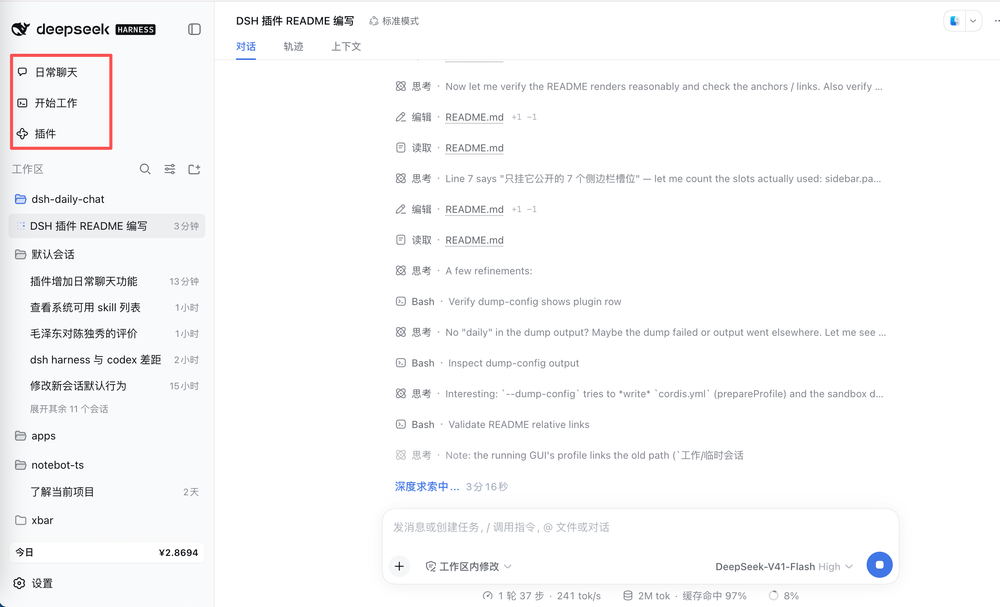

# dsh-daily-chat

> 给 DSH（DeepSeek Harness）的「新会话」加上第二重含义：**日常聊天** 与 **开始工作**。
>
> 日常模式跑一个只有对话能力的轻量 agent —— 有人格、能联网检索、能向你提问、能压缩上下文，但没有文件读写、没有 Shell、没有计划模式、没有子代理；工作模式完全沿用 DSH 原有行为，唯一多出来的东西是每轮回答页脚上那行耗时（就在「用量 / 时刻」那一行里，见[使用](#使用)与[已知限制](#已知限制)）。

一个纯客户端 DSH 插件：不 fork DSH 本体，只往它公开的 6 个槽位注册 11 条内容（其中「更多」那一对按需注册：面板行超过三个才出现，见下）、再加三个方法补丁（客户端两个导航方法、Host 一个预设选择），DSH 升级后不会把插件带坏。

<div align="center">
  
  <br />
  <sub>侧边栏顶部多出「日常聊天」「开始工作」两行（这张图早于「更多」开关），原生「新会话」按钮被隐藏；日常模式下工作区区域会换成日常会话列表</sub>
</div>

## 📑 目录

- [它解决什么问题](#它解决什么问题)
- [两种模式](#两种模式)
- [安装](#安装)
- [使用](#使用)
- [工作原理](#工作原理)
- [配置项](#配置项)
- [目录结构](#目录结构)
- [开发](#开发)
- [已知限制](#已知限制)
- [卸载](#卸载)
- [License](#license)

## 它解决什么问题

DSH 原本只有一个「新会话」，而它一定是完整的编码 Agent：带着工作目录、bash、文件读写、计划模式、子代理。用它来问一句「今天天气怎么样」或者闲聊两句，代价是模型手里攥着一整套会往仓库里动手的工具，提示词里也全是工程上下文 —— 答话的语气和边界都被带偏。

这个插件把入口拆成两个，像 ChatGPT 把 chat 和 work 分开那样：

| | 日常 | 工作 |
|---|---|---|
| 你点的是 | 侧边栏「日常聊天」 | 侧边栏「开始工作」，或其它任何「新会话」入口 |
| 跑的是哪个 agent | `daily` 预设 | profile 默认预设（默认 `standard`） |
| 模型手里的工具 | 对话人格、网页检索/抓取、提问、上下文压缩 | 全部 |
| 侧边栏那一片 | 换成日常会话列表 | 原生工作区浏览器，且不出现「日常聊天」这一行 |
| 上下文 | 锁死：改不了项目，也换不了 Agent 模式 | 随便改 |
| 会话落在哪 | 专属工作区（标题「日常聊天」） | 原有工作区 |
| 记忆 / 图片识别 / 模型路由 | 照常可用 | 照常可用 |

「日常」是一块真实的工作区而不是一个 UI 开关，所以日常对话是正常 Session：历史留得住，列表就是记账到该工作区的会话。

## 两种模式

| | 日常 | 工作 |
|---|---|---|
| 侧边栏入口 | 「日常聊天」整行，`order: -20` | 「开始工作」整行，`order: -10` |
| 菜单折叠 | 「更多」整行（`order: -5`）：把其余面板行折起来；面板行超过三个时才出现（三行以内整列照常显示），两个模式共用同一个开关，状态记在 localStorage | 同左 |
| 预设 | `daily` | profile 默认（本机为 `standard`） |
| 开场那一行 | 「项目」与「Agent 模式」两个 chip 都不出现 | 两个都在 |
| 能不能改上下文 | 不能：会话钉在「日常聊天」工作区上，预设钉在 `daily` 上 | 随便：项目、预设、计划模式、子代理 |
| 核心循环 | 用户消息 → 模型 → 工具调用（检索 / 提问）→ 回复 | 用户消息 → 模型 → 工具调用（读文件 / 改文件 / 跑命令 / 计划 / 子代理）→ 回复 |
| 会话列表 | 日常会话，按更新时间倒序，每行只有标题，运行中带绿点 | 原生分组列表 |
| 侧边栏的工作区 | 原生工作区列表整体让位给日常会话列表 | 原生列表，但**不出现**「日常聊天」这一行 |

三行都排在「插件」之上（该行 `order: 0`，槽位按 `priority`、`order` 升序排；「更多」是 `-5`）。原生侧边栏的「新会话」按钮会被隐藏，由「日常聊天」「开始工作」这两行取代；macOS 窗口控件等其它「新会话」入口仍然在，并按当前模式路由。

两个模式是互斥的视图，不只是换个预设：工作模式下侧边栏不列「日常聊天」—— 它不是项目，而且点一下整行就会把产品切回日常；日常模式下原生工作区列表整体让位给日常会话列表。

## 安装

### 0. 前置条件

- 一个可运行的 DSH web profile，**版本 ≥ `0.1.7`**。本版本在 DSH `0.1.7-alpha.2`、macOS 上验证过；依赖的槽位契约是 `sidebar.panellist` / `sidebar.workspaces` / `shell.overlay` / `main` / `conversation.chat.turnTail` / `conversation.chat.assistant-actions`。0.1.6 及更早从用户预设根读目录（见第 1 步），本版不再往那里写任何东西。后两个槽位都是给那行耗时用的，且互相兜底：只有 `turnTail` 时那行落在动作行下面，只有 `assistant-actions` 时不画（没有数字可读），两个都在才落进动作行、跟在时刻右边。老 DSH 上注入不进来的席位只是那行不出现，其余功能不受影响。
- 插件分两半：Host 半（[index.js](./index.js)）建工作区、锁日常会话的预设、提示老安装残留的预设目录；`daily` 预设由包内 patch 声明（见第 1 步）；客户端半（[client.js](./client.js)，`dsh.client.platform: web`）贡献全部界面。没有构建步骤。

### 1. `daily` agent 预设：随插件一起声明

日常模式跑的 `daily` 预设随包发布在 [preset/daily.patch.yml](./preset/daily.patch.yml)：一行 `@deepseek-ai/dsh-agent-preset` 声明，`config.plugins` 决定这个预设装哪些行（人格、网页工具、提问工具、压缩组），`config.name` / `config.description` 是选择器里的显示名与描述，`config.order: 5` 让它排在 harness 自带的四个预设（`standard` / `ptc` / `minimal` / `cordis`）之后。

DSH `0.1.7` 起，预设就是这种「由 bundle patch 带进来的 declaration row」，不再从 `<dshHome>/.agent-presets/<presetId>/` 读任何东西。所以本包把这份 patch 也列进 `dsh.bundle.patch`：**装上插件就装上了预设** —— 没有目录要复制，没有用户预设根要写，也没有「已存在就不覆盖」的规则。你在设置页里改过的预设，DSH 会按行 id `preset-daily` 覆盖到 profile 的 `cordis.patch.yml`（用户层，永远压过包内这一份）。

> 从 `0.1.6` 或更早的版本升上来：那些版本由 Host 半把 `preset/daily/` 复制到 `~/.dsh/.agent-presets/daily/`。这条老路在新 DSH 上已被完全忽略，旧目录留着不会有任何作用（插件每次启动会在控制台提醒一次），可以直接删掉。
>
> 没有这个预设也能跑起来：插件选预设失败时只打一条 warn 并回退到 profile 默认预设，代价是日常会话又变回完整编码 Agent —— 日常模式就失去意义了。

### 2. 把插件装进 profile

插件是 `private` 的本地包（包名 `@local/dsh-daily-chat`，不会发布到 npm），用链接方式装进某个 profile。

**方式 A：Web 侧边栏「插件」页** —— 安装组合包，填本仓库目录的绝对路径。管理器会读该目录的 `package.json`，确认它声明了 bundle patch，装好后默认启用。

**方式 B：命令行**

```bash
dsh plugin --profile web add link:/path/to/dsh-daily-chat
```

然后确认 profile manifest `~/.dsh/profiles/web/package.json` 的 `dsh.profile.bundles` 里包含了 `@local/dsh-daily-chat`，没有就手动加在列表末尾 —— bundles 是插件挂载顺序，放最后即可：

```json
"bundles": [
  "@deepseek-ai/dsh-base",
  "@deepseek-ai/dsh-web-app",
  "@local/dsh-daily-chat"
]
```

### 3. 生效

重启 `dsh web`，刷新页面。部署里启用了 HMR 的话配置改动会自己生效，否则运行中的组合会保留到重启。侧边栏面板列表顶部会多出「日常聊天」「开始工作」两行；这一列的面板行一旦超过三个（本部署里是「插件」「定时任务」两行），两行下面还会多一个「更多」开关；只排着「插件」时整列照常显示（见[文首截图](./assets/sidebar-modes.png)）。原生「新会话」按钮同时消失。

装好后开一个**新会话**验证：点「日常聊天」应该直接落在一个空白会话的输入框里，且该会话没有 bash / 文件类工具。

## 使用

- **点「日常聊天」** —— 解析（必要时创建）日常工作区 → 打开一个空白会话 → 把它的预设切成 `daily` → 把中间栏交还会话。中间只会闪一帧占位文字，不会停在中间页。
- **点「开始工作」** —— 记下工作模式，走 DSH 原生的 `startSession`。
- **点「更多」把这一列收干净** —— 侧边栏顶部那两个模式入口下面还排着「插件」「定时任务」等面板行，点「更多」把它们折起来，只留「日常聊天」「开始工作」「更多」三行；箭头跟着翻转，再点一次全部回来。折叠的是**所有** glyph 不带本插件标记的行，所以以后别的插件加的行也会一起收进去（那些插件并没有被卸载，只是这一列不画它）。状态存在 localStorage 的 `dsh.daily-chat.panels`，刷新后保持；它只折叠这一列，不动中间栏。面板行回落到三个以内时这一行自己就不注册了 —— 留着它也没有可折的东西，只会多一个点了没反应的按钮；第三方插件把行加到第四个，它会自己长回来（见[工作原理](#工作原理)）。
- **工作模式里不出现「日常聊天」这一行，它的会话也不出现** —— 侧边栏的工作区列表读的是同一个模型，插件在工作模式下把日常工作区从那份快照里投影掉：宿主侧的注册、会话日志、目录都原样保留，只是这个前端不画它。光藏那一行不够 —— 浏览器的「未分组」是拿「会话列表 − 可见工作区的记账」算出来的，藏了行那些会话会整批掉进「未分组」，所以工作模式下属于日常目录的会话也从会话列表里一并去掉（按工作区记账和按会话 `cwd` 两条判据都算，后者是宿主半锁预设用的同一条规则）。顺带修掉一个岔路 —— 原生「新会话」会按「当前会话所属的工作区」挑目标，在日常聊天里点「开始工作」时那个当前会话正属于日常，于是新会话又被开进日常聊天；现在这一步已经看不见那个工作区了，目标落到最近用过的**工作**项目上，一个工作项目都没有时中间栏回到空白首页。
- **日常里改不了上下文** —— 日常聊天只有「日常聊天 / `daily`」这一种上下文，所以开场那行的「项目」和「Agent 模式」两个 chip 直接不出现；从别处发起的工作区切换（空会话里那个「选工作区」提示、目录选择器）会被服务层拒绝并弹一张提示卡，从设置页把某个预设「设为默认」也改不动日常会话的预设，只会看到 DSH 原生的「无法切换到…」。想换项目或换能力，先点「开始工作」。
- **模式会记住** —— 存在 localStorage 的 `dsh.daily-chat.mode`，读写失败时一律按 `work` 处理，不改变原有习惯。
- **日常列表** —— 日常模式下，侧边栏工作区区域被替换成日常会话列表，这整块（分区标题 + 加号按钮）照抄工作模式那一块：36px 行高、`margin` 与左内边距一致，标签不再自带字号字距，直接继承侧栏自己的字号（插件把整列压到 13px，见下一条）与分区标题的三级字色，`max-width:45%` 保证挤不到按钮；按钮是同一个 `IconProjectAddOutline16`、同一套 28px 圆形 hover 样式、同一套右边距 —— 只靠 `--dsh-sidebar-inline-padding` 内缩，右边缘与侧栏内容框齐平（工作模式那条 `margin-right:-4px` 在这版 DSH 里实测没生效，所以这里按实测而不是按那行声明对齐），展开时 16px、收起时 18px。列表本体的滚动几何也照抄工作模式那一套：外面再套一层 `listArea`，用 `margin-right:calc(-1 * 内缩)` 把列表整个拉回**侧栏外缘**，列表自己再 `margin-right:2px` + `scrollbar-gutter:stable` + `padding-right:calc(内缩 − 滚动条 8px − 2px)`。隔着一张对照截图量出来的结果是：滚动条右缘落在侧栏外缘内 **2px**（工作模式实测 2px，改之前我们是 14px），行的右缘落在内容框边缘（两边都是外缘内 12px），而且列表会不会滚动都不会左右抖。点一行打开该会话并确保仍处于日常模式；行里只有一个状态点和一个标题，不显示时间。那个加号等同于点「日常聊天」。
- **整列字号 13px** —— 侧栏那一列自己在根节点上声明 14px，凡是不自带字号的角色都继承它：模式行（「日常聊天」「开始工作」「更多」「插件」）、工作区浏览器的标签、日常列表的表头。插件把这一列整个压到 13px，正好和日常行原本的字号（13px）并成同一个刻度。四个「自己钉死 14px、不靠继承」的角色跟着降：会话／工作区行标题、浏览器里搜索结果标题、行内重命名输入框、页脚那个「设置」入口 —— 这四条写的是 `font-size:inherit` 而不是写死 13px，跟着根节点走。品牌名（18px）、12px 的构建号、以及 portal 出这个子树之外的设置弹层都不受影响。定位这一列既没有 id 也没有 `data-*` 可用，用的是 `div:has(> div[class*="footArea"])`：`footArea` 是 `@deepseek-ai/dsh-client-ui-sidebar` 的 CSS-module 局部名，两种宽度下都渲染，本部署里没有第二处（不用 `panelList` 做锚点，是因为没有面板注册时整个 `<nav>` 都不渲染）。规则靠选择器权重压过原生那条 `.root{font-size:14px}`，不依赖样式表的先后顺序。
- **收起侧栏，这一区整个让位** —— 点侧栏顶部那个收起图标之后，工作模式的分区标签和会话列表都不再渲染（标签只在展开时给，列表整个不出现）。日常这边更进一步：轨道态把**整块表头（标签 + 加号）和会话列表一起藏掉**，日常那一区什么都不画。理由有两条 —— 轨道的内容宽度只有 ~36px，列表挤进去只会糊成一团；而留着那个加号的话，它的中心在实测里比上方那排模式图标偏左 4px（图标列中心 28.75px，加号在 24.75px），与其为它单独对齐，不如让轨道回到「只用来切模式」的样子。再点一次展开，标题和列表都回来。
- **日常会话标题栏不带模式图标** —— 会话一开始，标题栏那个 Agent 预设胶囊只留「日常聊天」四个字，前面的小图标去掉：那个图标的意思是「这个会话跑在哪个 agent 模式下」，日常里这个答案永远是同一个，留着只是噪音。工作模式下照旧带图标。
- **每轮回答的页脚上多一行耗时** —— 一轮结束（`turn/end`）后，在这条回答页脚里「用量 1.1M tok / 07:35」那一行的最右端（时刻右边）多出 `用时 12秒`。数字就是这一轮从开始到结束的墙钟时长，单位按 DSH 自己的规矩凑：满一分钟才出现「分」，满一小时才出现「小时」，秒永远出现，所以是 `45秒` / `1分30秒` / `1小时1分1秒`，英文是 `45s` / `1m 30s` / `1h 1m 1s`。鼠标悬停能看到这一轮起止两端的绝对时刻（按本机时区格式化）。被中断或出错的一轮照样显示，只是标签换成 `已中断，用时` / `已出错，用时`（见[已知限制](#已知限制)）；两种模式都有这一行。
- **点击串台保护** —— 一次日常会话还没打开时又点了「开始工作」，以最后一次为准（内部用递增 ticket 作废过期的启动）。
- **失败会说话** —— 日常工作区准备不出来时会退回系统目录选择框让你手挑一个文件夹；仍然失败则在左下角弹一张提示卡，而不是静默什么都不发生。

## 工作原理

### Host 半 —— [index.js](./index.js)

做三件浏览器做不可靠的事：

1. **盯住 `daily` 预设的迁移。** 预设本身由包内 [preset/daily.patch.yml](./preset/daily.patch.yml) 声明（见[安装](#安装)第 1 步），Host 半只做一件事：如果发现某个老安装留下的 `<harness home>/.agent-presets/daily/`，就在控制台打一条提示，说明它已不再被读取、可以直接删（走 `console.warn` 而不是 `ctx.logger`：查过的部署里 logger 的输出没有接到服务端控制台，而这条提示的全部意义就是被人看见）。那个目录长得就像「预设已经装好了」，是排查「预设没了」时第一个该排除的东西。
2. **建并注册日常工作区。** 在 `<DSH_HOME>/daily-chat`（默认 `~/.dsh/daily-chat`）建目录，注册成标题为「日常聊天」的工作区；注册是幂等的，已注册的路径不动。
3. **把日常会话钉在 `daily` 预设上。** 在 `agentPresets.select` 的原型上补一层：会话的 `cwd` 是日常目录、而目标预设不是 `daily` 时直接拒绝，客户端会把它显示成 DSH 原生的「无法切换到「标准模式」：…」。这条只能落在 Host：客户端那半能藏掉 chip，但预设还有别的入口 —— 设置页的「设为默认」会顺手写进当前空白会话 —— 而预设决定模型手里到底有哪些工具。

三条都是尽力而为：第一条本来就只是提示，工作区那条失败也只打一条 warn，客户端会各自兜底（预设退回部署默认值，工作区退回目录选择框）；第三条在拿不到 `agentPresets` 时什么都不做，只是不锁。客户端那半用目录 basename `daily-chat` 认领工作区、按 id `daily` 选预设，所以浏览器永远不用猜路径、也不会一开始就弹框问人；`DSH_HOME` 的读法与部署其它部分一致，未设置时用 `~/.dsh`。

### Client 半 —— [client.js](./client.js)

六个槽位上的十一条注册、三个原型补丁、一个 store 补丁，外加两个 `<html>` 属性（Host 那半另有一个预设补丁，见上）：

| 席位 | 配置 | 作用 |
|---|---|---|
| `sidebar.panellist` ×3 | `order: -20` / `-10` / `-5` | 三个带图标 + 文字的入口，排在「插件」之上：「日常聊天」「开始工作」「更多」。行长得像「插件」，点击权归侧边栏，只能 `selectPanel(id)`。前两行常驻，「更多」按需注册（这一列超过三行才注册，回落到三行以内就注销） |
| `main` ×3 | `key: daily-chat` / `daily-chat-work` / `daily-chat-more` | 每行配一个面板。前两个执行一次动作后立刻把中间栏交还会话 —— 这就是两行都直接落进输入框、没有中间页的原因；「更多」那个不画任何东西，只翻转折叠属性并把中间栏交还（每个 `panellist` id 都必须配一个 `main` 面板，否则 `selectPanel` 找不到目标） |
| `sidebar.workspaces` | `priority: -1`，仅日常模式注册 | 单值槽位只有「活着的、优先级最低的」那一条会渲染，所以 `-1` 接管工作区区域，注销即让原生浏览器回来 |
| `shell.overlay` ×2 | 全局 | 全部 chrome 规则：藏原生「新会话」按钮、日常下藏开场那行、日常下摘掉标题栏预设胶囊的图标、折叠时藏掉不带本插件标记的面板行（再加箭头翻转）、把侧栏整列字号压到 13px；失败提示卡 |
| `conversation.chat.turnTail` | `order: 20`，两种模式都注册 | 每轮回答页脚那行耗时的**载体**：把 `用时 12秒` / `已中断，用时 1分0秒` 这组数字写在一个隐藏节点上（`data-dsc-elapsed` / `-reason` / `-start` / `-end`），同时画一条自己的兜底行备用。数字直接来自槽位递过来的 `turn.start.time` / `turn.end.time` 两个时间戳，单位与凑法照抄 DSH 自己过程组抬头那套，所以这里不订阅服务、不存状态、也不算第二遍耗时 |
| `conversation.chat.assistant-actions` | `order: 20`，两种模式都注册 | 同一行耗时的**画笔**：这个席位是 DSH 唯一渲染进「复制/分支/时间」那一行内部的位置，它从行里往上找到所属轮次的容器（`[data-turn-tail]`），读回载体上的四个数，再画 `用时 12秒`；CSS `order: 1` 让它落到「用量 / 时刻」右边。读不到载体就整条不画，兜底行继续顶着 |
| `uiWorkspace.startSession` 原型补丁 | — | 所有「新会话」入口都汇聚到这一个方法。日常模式下它改道去开日常会话；另外它也是「开始工作」要调回的原方法 |
| `uiWorkspace.openWorkspace` 原型补丁 | — | 所有「切项目」都汇聚到这一个方法：开场那行的「项目」chip、空会话里的工作区提示、目录选择器。日常模式下目标不是日常工作区就拒绝（reject + 提示卡），reject 还顺带把选择器乐观显示的那个名字收回去 |
| `workspaces.list.getSnapshot` 原型补丁 | — | 工作模式下把日常工作区从工作区快照里投影掉（日常模式原样返回）。同一份原始快照只投影一次并按身份缓存 —— `useWorkspaces` 的 selector 是按 `Object.is` 比较的，每次给新对象会无限重渲染 |
| `sessions.list.getSnapshot` store 补丁 | — | 工作模式下把日常会话从会话列表的 `ids` 里去掉，否则它们会从工作区行下面整批挪进「未分组」（那一组是按「会话列表 − 可见工作区记账」算的）。只动 `ids`，`byId` 保持完整，所以主栏里打开着的那个会话仍有摘要与状态。这一条打在 store 对象自己身上 —— 它不是类实例，没有共享原型可用 |
| `<html data-dsc-mode>` | 仅日常模式写着 | 模式相关的 CSS 靠它生效；插件卸载时移除 |
| `<html data-dsc-panels="more">` | 仅折叠状态写着 | 折叠相关的 CSS 靠它生效；展开时移除，插件卸载时也移除 |

补丁打在服务**原型**上而不是实例上：Cordis 发给每个使用方的都是同一个实例的独立 traceable 代理，而侧边栏早在插件加载之前就抓住了自己那份代理，Host 的 API 网关也是每次调用才从原型上取方法。工作区快照那层同理：`useWorkspaces` 这个 hook 每次读都经同一个 model 调 `getSnapshot()`（`subscribe` 与 `getSnapshot` 各自被包成稳定闭包，来源只捕获一次），所以投影不用重新订阅就即时生效，卸载时把原型方法还回去即可。会话列表是唯一的例外：它是个对象字面量而不是类实例（`createSnapshotStore` 的返回值），没有共享原型可用，所以那条补丁直接换掉对象自己的 `getSnapshot` —— 浏览器发布的正是同一个对象（`provideRoot({ hooks: { sessions: sessions.list } })`），所有 `useSessions` 读到的还是同一个投影。

折叠是这套里唯一**不碰服务层**的动作：它不改注册、不换快照、不打补丁，只把 `<html>` 上一个属性翻一下，由一条 CSS 决定哪些行不画。行上没有 id 也没有 `data-*`（只有哈希类名、`aria-label` 和 `aria-current`），插件也没法注销别人的注册，所以判据只能反过来写 —— 给自家每个 glyph 打上 `data-dsc-keep`，再藏掉按钮里没有这个标记的行。不过「这一行要不要存在」倒是在读服务层：`ctx.slots.entries('sidebar.panellist')` 数一圈（「更多」自己不算），超过三个入口就注册「更多」；回落到三个以内就注销，并把折叠属性一并摘掉 —— 否则会留下一批被藏起来的行、却没有东西能把它们展开。判定挂在 `ctx.slots.subscribe('sidebar.panellist', …)` 上（槽位变更按 microtask 批次通知），所以第三方插件后注册的行会自己让这一行长回来。

「不出现 + 拦得住」是两层：开场那行是 CSS 按 `<html data-dsc-mode="daily">` 藏掉的（看不到就点不到），服务层那两个补丁负责挡住绕过 UI 的路（空会话里的工作区提示、设置页改默认预设、以后新加的入口）。

那行耗时值得单独说一句取舍。DSH 本来就算过这个数 —— 过程组抬头那句「已完成，用时 …」用的就是同一对时间戳，而且**两种模式的已完成轮次页脚都不显示耗时**是 DSH 写明的设计决定，默认的简洁/标准/详细模式还会在轮次结束时把过程组整块折起来，于是「这一轮花了多久」在当前界面上无处可读。`conversation.chat.turnTail` 是已结束轮次上唯一稳定绘制、且不会被折叠的席位，所以这行就是把这笔已经算好的账搬到一个看得见的地方，没有新增任何测量。它也因此是插件唯一动到工作模式的东西（见[已知限制](#已知限制)）。至于这行怎么落进动作行、而且跟在时刻右边：`turnTail` 只覆盖页脚上半段这一层，复制/分支/时间那一行本身是 DSH 直接画的、没有槽位可以直接往里插；能进去的只有一处 —— DSH 把 `conversation.chat.assistant-actions` 的内容当 `extraActions` 渲染进那一行，而它按 DSH 的固定顺序排在分支按钮与「用量 / 时刻」**之前**。所以插件拆成两面：`turnTail` 那面只负责把四个数（时长、结束原因、起止时刻）写在一个隐藏节点上，`assistant-actions` 那面从行里往上找到所属轮次的容器、读回这四个数，再靠一条 CSS `order: 1` 把自己排到那一行的最右端（插槽的锚点元素是 `display: contents`，规则正好落在真正的 flex 子项上）。两个席位同属一个 `[data-turn-tail]` 容器、同一次提交里落到 DOM，所以读回是 O(1) 的 `closest` + `querySelector`，不遍历会话、不订阅 store；哪天另一面不在（老 DSH、别的前端），`turnTail` 自己那条兜底行还在，只是回到动作行下面。

其它值得知道的点：

- 宿主服务/标准 props 缺失时全部退化成空快照（`EMPTY_WORKSPACES` / `EMPTY_SESSIONS`），不会因为某个来源没装而崩。
- 中英文案都写在 [client.js](./client.js) 顶部，注册在 locale 命名空间 `dailyChat`。
- 日常工作区还没解析出来时，`staysDaily` 会放行而不是拦死 —— 宁可少锁一次，也不让导航在启动那一瞬间卡住。

## 配置项

| 名字 | 值 | 说明 |
|---|---|---|
| localStorage key | `dsh.daily-chat.mode` | 当前模式，`daily` / `work` |
| localStorage key | `dsh.daily-chat.panels` | 面板行是否折叠，`more` / `all`；异常一律按 `all`（全展开） |
| 日常 agent preset id | `daily` | 声明在 [preset/daily.patch.yml](./preset/daily.patch.yml) 的 `config.id`；客户端与 Host 半按 `DAILY_PRESET` 认它。想换成自己的预设，三处都要改 |
| 模式属性 | `data-dsc-mode="daily"`，挂在 `<html>` 上 | 只在日常模式存在；模式相关的 CSS 全部挂在它下面，插件卸载即移除。见 [client.js](./client.js) 的 `MODE_ATTRIBUTE` |
| 折叠属性 | `data-dsc-panels="more"`，挂在 `<html>` 上 | 只在折叠状态存在；折叠相关的 CSS 挂在它下面，展开即移除。见 [client.js](./client.js) 的 `PANELS_ATTRIBUTE` |
| 行标记 | `data-dsc-keep` / `data-dsc-more` | 打在本插件注册的三个 glyph 上：前者是「这行别折」，后者供箭头翻转用。折叠规则靠它反选别人家的行 |
| 预设声明位置 | 包内 [preset/daily.patch.yml](./preset/daily.patch.yml) | 作为 bundle patch 的一层随插件挂载生效，不落任何目录；`<dshHome>/.agent-presets/daily/` 是 0.1.6 时代的老路径，已不再被读取 |
| 日常工作区目录 | `<dshHome>/daily-chat`，默认 `~/.dsh/daily-chat` | Host 建目录；客户端按 basename `daily-chat` 认领；Host 侧也按这个目录判断「这是不是日常会话」 |
| Host 目录常量 | `daily-chat` | 见 [index.js](./index.js) 的 `DAILY_DIRECTORY`，与客户端常量需一致 |
| locale 命名空间 | `dailyChat` | — |

## 目录结构

| 文件 | 作用 |
|---|---|
| [package.json](./package.json) | 包名、`exports`、`dsh.bundle.patch`、`dsh.client`（`platform: web`、`immediately`、`inject`、`external`） |
| [cordis.patch.yml](./cordis.patch.yml) | 一行 `insert`，把这个包挂进 profile |
| [index.js](./index.js) | Host 半：建目录并注册工作区 + 锁住日常会话的预设 + 提示 0.1.6 时代残留的预设目录 |
| [client.js](./client.js) | Client 半：全部 UI、状态、「新会话」路由、项目锁定、工作模式的工作区/会话过滤与面板行折叠 |
| [preset/daily.patch.yml](./preset/daily.patch.yml) | `daily` 预设本体：一行 `@deepseek-ai/dsh-agent-preset` 声明，`config.plugins` 就是它的组装 |
| [assets/sidebar-modes.png](./assets/sidebar-modes.png) | README 用截图：侧边栏顶部的两行模式入口（早于「更多」开关） |

## 开发

- **没有构建步骤。** [client.js](./client.js) 是手写的 ESM 工厂（`window.__ModuleLoader__.load`），由客户端模块加载器直接读取；改完刷新页面即可，没生效就重启 `dsh web`。
- **改名要改三处。** 包名同时出现在 [package.json](./package.json)、[cordis.patch.yml](./cordis.patch.yml) 的 `name`、以及 [client.js](./client.js) 里 `load({ id })` 的 `id`；profile 的 `bundles` 里也是这个名字。
- **调预设。** 改 [preset/daily.patch.yml](./preset/daily.patch.yml)（可用的行、提示词段落、显示名与描述）后，让 profile 重新读到这份 patch：重装一次这个包，或重启 `dsh web`（部署里启用了 HMR 的话会自己生效）。想在本机临时改，就在 profile 的 `~/.dsh/profiles/web/cordis.patch.yml`（用户层）里按行 id `preset-daily` 覆盖 `config.plugins` —— 设置页里保存的编辑走的就是这条路，所以它不会被包内的版本盖掉。
- **手动验证清单：** ① 侧边栏「日常聊天」「开始工作」两行在「插件」之上（这一列的面板行超过三个时，两行下面还多一个「更多」）；② 点「日常聊天」直达输入框且工具列表里没有 bash/文件类；③ 日常模式下列表只显示日常会话；④ 切「开始工作」后列表还原成原生工作区浏览器；⑤ 关掉插件后原生「新会话」按钮回来；⑥ 预设选择器里有「日常聊天」（`order: 5`，排在 harness 自带四个之后），点开它列的正是人格 + 网页 + 提问 + 压缩；在干净的 `DSH_HOME` 下启动一次，只有 `<DSH_HOME>/daily-chat/` 会被创建（预设来自包内 patch，不落目录）；⑦ 日常模式下开场那行整个不出现（项目与 Agent 模式两个 chip 都没有），`<html>` 上能看到 `data-dsc-mode="daily"`；⑧ 在设置页把标准模式「设为默认」，日常会话的预设不动、只看到 DSH 原生的拒绝提示；⑨ 点「开始工作」照旧出得来，出来后项目 chip 与 Agent 模式 chip 都回来了；⑩ 工作模式的侧边栏里没有「日常聊天」这一行、「未分组」里也没有日常会话（只剩别的旧会话），而你在日常聊天里点「开始工作」之后，新会话落在最近用过的那个工作项目上（一个工作项目都没有时中间栏是空白首页）；⑪ 点「更多」后「插件」「定时任务」等行消失、「更多」的箭头翻转，刷新页面仍保持折叠；再点一次全部回来，中间栏不被切走；把「插件」「定时任务」这些行都关掉、这一列回落到三行以内后，「更多」自己不出现（localStorage 里的折叠状态留着但不生效），重新启用后它连着折叠一起回来；⑫ 随便问一句（不用工具，几秒就答完），回答页脚「用量 10.1M tok / 07:33」那一行的**右端**（时刻右边）出现 `用时 …秒`，并且那一行下面**不再**另起一行（两面的互斥规则应当把兜底行藏掉）；把它和过程组抬头那句「已完成，用时 …」对一下 —— 两个数应当一致；找一轮长时间思考的，看它满 60 秒后变成 `1分…秒`；悬停这行能看到起止时刻；⑬ 在日常模式下打断一轮（发送中途点停止），页脚出现 `已中断，用时 …`；⑭ 切到工作模式问一句，页脚同样有这行耗时；⑮ 侧边栏整列字号都是 13px —— 「日常聊天」「开始工作」「更多」「插件」四行、切换后的工作模式会话行标题、页脚的「设置」、日常列表的表头，在 DevTools 里量都应当是 13px，而品牌名仍是 18px、构建号仍是 12px，设置弹层里的字也照旧。

## 已知限制

- **原生「新会话」按钮只能靠 CSS 隐藏。** 它是侧边栏里的手写 JSX，外面没有槽位能替换它，唯一的杠杆是 `button[class*="newSession"]{display:none}`。DSH 若改掉这个 CSS-module 类名，规则失配、按钮重新出现 —— 失败方向是「多一个按钮」，不会误伤别的东西。macOS 窗口控件用的是另一个模块的另一个类名，不受影响。
- **开场那行的隐藏也是 CSS，同样怕改名。** 规则是 `html[data-dsc-mode="daily"] [class*="heroWorkspaceRow"]`，命中 `@deepseek-ai/dsh-client-ui-conversation` 里那个行容器。DSH 改名后 chip 会重新出现，但服务层那两个补丁还在拦，所以失败方向是「看得见、点了被拒」，不是「又能切了」。
- **整列字号靠一个 CSS-module 局部名定位。** 侧栏根节点没有 id 也没有 `data-*`，唯一的锚点是 `div:has(> div[class*="footArea"])`，`footArea` 取自 `@deepseek-ai/dsh-client-ui-sidebar`。DSH 若改掉这个名字，根节点和四条子规则一起失配，这一列安静地回到原生的 14px —— 失败方向是「又变大一号」，不会误伤别的东西。四条子规则（`title` / `searchResultTitle` / `renameInput` / `trigger`）同样按局部名匹配，而且**大小写敏感**，所以 `panelTitle`、`localBuildTitle`、`navTitle` 这些大写 T 的同类不会被动到 —— 这是有意的：品牌下面那行构建号是刻意的小字；`hoverTitle`（悬停卡片）则根本不在这个子树里，它由 primitives 渲染到 body 上，维持在 14px。
- **两条锁定靠的是三个方法名。** 客户端补 `uiWorkspace.startSession` / `uiWorkspace.openWorkspace`，Host 补 `agentPresets.select`。任何一个被改名或改签名，对应的那条锁静默失效（补丁取不到原方法就不装），不会连带报错。Host 那条按会话 `cwd` 是否等于 `<harness home>/daily-chat` 判断，所以把日常会话手工挪出那个目录之后就不再受锁 —— 那时候它本来也不再是日常会话了。
- **日常会话转正仍然要手工搬内容。** 锁的是上下文，不是内容：想让一次日常对话变成工作任务，还是得先「开始工作」，再把内容复制过去。
- **日常列表里不显示时间。** 一行只有状态点和标题，看不到「多久以前」；排序仍是按更新时间倒序，所以新旧只能靠相对位置判断。
- **列表头部那个加号按钮依赖 primitives 的导出。** 图标取自 `@deepseek-ai/dsh-client-ui-primitives` 的 `IconProjectAddOutline16`（工作模式同一个），取不到就退化成一个纯文本「＋」，不会崩。
- **摘掉预设胶囊的图标靠「槽位锚点 + 形状」。** 规则是 `[data-slot="conversation.session.header.actions"] > span[title] > svg`，前一半是槽位键（本插件本来就往这个槽位注册），后一半是那个胶囊的形状：根元素是带 `title` 的 `<span>`、图标是它的第一个直接子元素。同槽位的其它占用方（任务、计划、终端、费用表）都是按钮或 `<div>`，所以这条只命中一个元素。DSH 若改了槽位键或那个胶囊的根元素，图标会重新出现。
- **「更多」的折叠是视觉层的，不是注销。** 面板行上没有 id、也没有 `data-*`（只有哈希类名、本地化的 `aria-label` 和 `aria-current`），插件也没法注销别人的注册，所以折叠只能反过来做：给自家三个 glyph 打上 `data-dsc-keep`，再藏掉按钮里没有这个标记的行。面板本身还挂着，只是这一列不画它 —— 折叠是「这一列只剩三个入口」，不是「禁用其它面板」。规则要吃 `:has()`（Chromium 105+，本部署的 Electron 远高于此）；DSH 若改掉面板列表的类名，规则失配、所有行照旧可见。反过来，**以后别的插件加的行也会被一起折进去**（这是有意的：折起来就该只剩这三个入口），那些插件并没有被卸载。另外，「更多」本身按需出现：这一列的面板行不超过三个就不注册 —— 三行本来就全显示得下，多一个按钮反而是多余的；读不到面板列表就按「不需要折」处理，这一行不注册，其余功能不受影响。
- **Windows 上要留意。** 标题栏轨道布局会收起侧边栏面板列表，那个被隐藏的按钮原本是剩余入口；当前只在 macOS 验证过。
- **两个模式的会话互相看不见。** 它们分属两个工作区，各自的列表只显示自己那一边；工作模式的侧边栏连「日常聊天」这一行、以及它名下的那些会话都不画（只是这一个前端不画：宿主侧的注册、会话日志、目录都还在，`~/.dsh/storages/workspace.json` 里也照旧）。代价是工作模式里没法从「已归档」视图里恢复一条日常会话 —— 切到日常模式再操作。
- **工作模式藏哪一行，靠「路径优先、特征兜底」两段判断。** 先认 Host 报上来的 `<home>/.dsh/daily-chat` 这个路径；路径对不上才退回「目录名是 `daily-chat` **且**标题是 `日常聊天`」。这一条比认领日常会话那套规则更严是有意的：多一点误判会把用户自己的项目从侧边栏里抹掉，少一点误判只是那一行还在。
- **那行耗时是插件唯一动到工作模式的地方（有意如此）。** 它是全局注册的，不受 `data-dsc-mode` 门控 —— 诉求就是「每轮结束能看到这轮花了多久」，把它只留给日常模式会出现「工作模式里静默没有」的意外。想回到「工作模式一行都不改」，只需给 `conversation.chat.turnTail` 与 `conversation.chat.assistant-actions` 那两条注册各加一个模式判断（或在 CSS 上按 `<html data-dsc-mode="daily">` 收窄），几行以内的事。它不覆盖 DSH 的过程组抬头，是并存的第二处显示；但如果你的部署里同时装了 `dsh-cost-meter`，两家都画在这个页脚里：cost-meter 的「本轮费用」折叠块在动作行**上方**（`order: 10`），本插件这行耗时在动作行**里面、时刻右边**，互不冲突。
- **不是以回答收尾的轮次，这行只在悬停时可见。** DSH 对「停在工具调用或打断处、后面没有回答」的轮次，把整条动作行做成悬停才淡入（`data-actions-reveal="hover"`，且只在 `@media (hover:hover)` 下生效）；耗时既然长在这一行里，也就跟着只在悬停/聚焦时出现 —— 与它旁边的 `07:35` 同一命。以回答收尾的轮次是常显的（`data-actions-reveal="always"`），这也是最常见的情形。
- **中断与出错的那一轮，这里显示数字，DSH 的过程组抬头不显示。** 抬头在 `reason` 是 `aborted` / `error` 时整句略去耗时，只写状态词；页脚这行则写成 `已中断，用时 1分0秒` —— 「这轮花了多久」对中断的轮次同样成立，而用户看到的最可能是一轮被自己打断、想确认白等了多久。数字的来源与完成的一轮完全相同（`turn.end.time - turn.start.time`，不足一秒按 DSH 的规矩抬到一秒），没有猜测成分。
- **缺时间戳就先不画。** `turn.start` 落在已加载窗口之外、或轮次尚未结束（`status !== 'closed'`）时这一行整个不出现 —— 不画一个 0 秒，也不猜一个开始时间。相应地，如果 DSH 改了 `turn.start` / `turn.end` / `turn.end.data.reason.kind` 这几个字段的形状，页脚会退回「不显示」而不是显示错数（`turn` prop 本身没了则注册静默失效）；`assistant-actions` 那面还多一层自保：读不到载体或读到的数不是数字，就整条不画，不会画出一个猜的时长。悬停里的绝对时刻用 `toLocaleString()`，跟随本机时区与语言。
- **工作模式的投影靠两处 `getSnapshot`。** 工作区那层取不到 `workspaces.list.getSnapshot` 原型方法就什么都不做（日常那一行重新出现在工作列表里）；会话那层要在 store 对象上写 `getSnapshot`，写不进去就退化成「日常会话回到未分组」。两处都不会连带报错，其余功能不受影响。之所以只能在视图层过滤：`WorkspaceView` 上没有任何可用标记 —— DSH 目前既没有 `hidden` 字段，也没有「系统工作区」这类概念；而「未分组」是拿「会话列表 − 可见工作区记账」现算的，所以藏工作区必须连会话一起藏。
- **只服务 web profile。** headless / tui / sdk 等 profile 没有这些槽位，装了也没有界面。
- **预设机制绑在 DSH `0.1.7` 及以上。** `0.1.6` 及更早从用户预设根（`<dshHome>/.agent-presets/`）读目录，不认 declaration row，而 `0.1.7` 起那个根已无人读取；本版只用 declaration row 声明预设，所以在更老的 DSH 上日常会话会静默退回 profile 默认预设（浏览器控制台里能看到一条 warn）。
- **注意槽位占用冲突。** 单值槽位在同一 `priority` 上被两条注册占用会直接抛错（`sidebar.workspaces` 在 `priority: 0` 已被 ui-workspace 占用，本插件用 `-1` 才安全）；list 槽位同 `id` 同 `priority` 亦然。同 profile 里再装一个改相同席位的插件前，先确认优先级。
- **`package.json` 还没有 `license` 与 `engines.dsh`。** 对外发布前建议补上。

## 卸载

**方式 A：Web 插件页** 关掉或删除该组合包。

**方式 B：命令行**

```bash
dsh plugin --profile web remove @local/dsh-daily-chat
```

并把 `@local/dsh-daily-chat` 从 profile manifest 的 `dsh.profile.bundles` 里去掉。隐藏按钮的 CSS 是插件自己渲染出来的，插件一卸载规则就跟着消失，原生「新会话」按钮自动回来。

可选清理（不做也不影响使用）：

- `~/.dsh/.agent-presets/daily/` —— 只有从 `0.1.6` 或更早的版本升上来的机器上才有（老版本插件复制进去的），DSH `0.1.7` 起不再读取，可以直接删；预设本体在包内 patch 里，随插件一起卸载；
- `~/.dsh/daily-chat/` 与 `~/.dsh/storages/workspace.json` 里那条工作区记录 —— 想彻底抹掉日常会话历史；
- 浏览器 localStorage 的 `dsh.daily-chat.mode`。

## License

本仓库尚未声明开源协议。若要发布到 GitHub / npm，建议补一个 `LICENSE`（如 MIT），并在 [package.json](./package.json) 里加上 `"license": "MIT"`。
